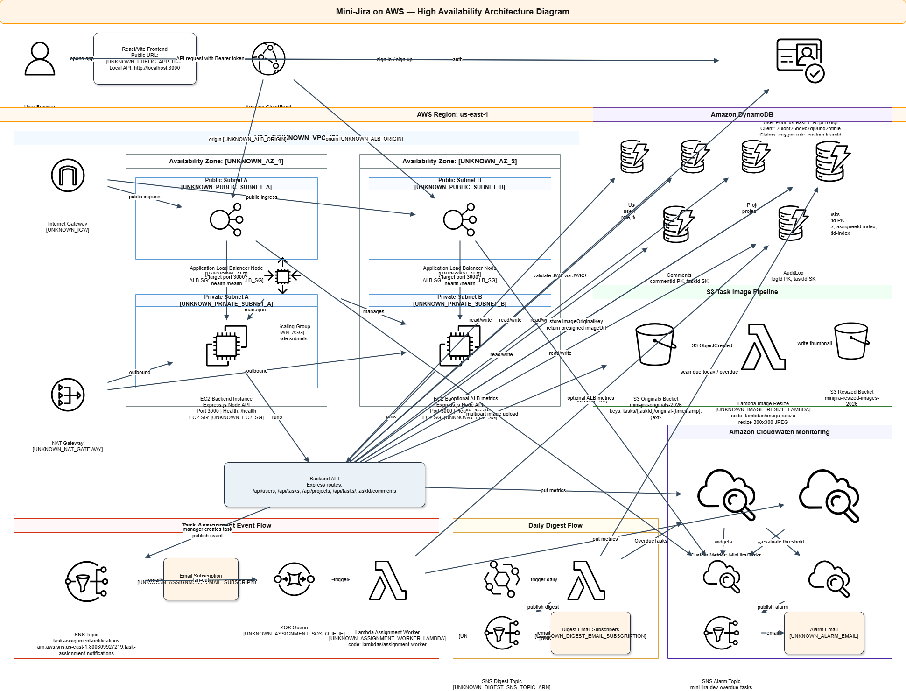

# Mini-Jira on AWS

## Live Application
https://d23kwe4cyjml0b.cloudfront.net

## Architecture Diagram

## Test Accounts
- Manager: ali@gmail.com / Test@1234
- Employee (Frontend): sara@gmail.com / Test@1234
- Employee (Backend): omar@gmail.com / Test@1234

## Tech Stack
- Frontend: React + Vite
- Backend: Node.js + Express
- Database: DynamoDB
- Auth: AWS Cognito
- Storage: S3
- CDN: CloudFront
- Notifications: SNS + SQS
- Serverless: Lambda
- Monitoring: CloudWatch